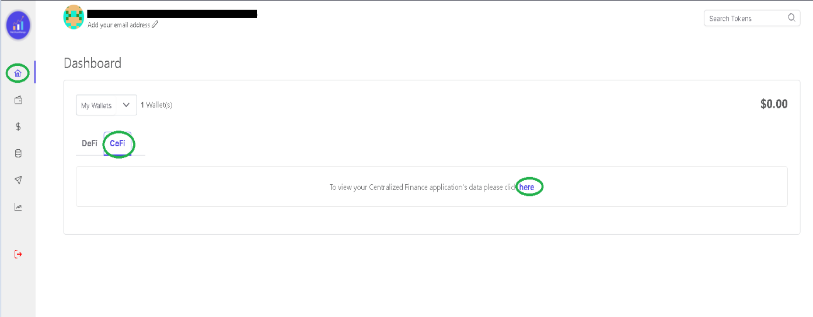

## How do I connect to my CeFi Accounts?

With Web3AssetManager you can seamlessly go through all your wallets and have a track of all your assets both in DeFi as well as CeFi. 

In order to add CeFi wallet to your existing account. They can all be controlled from the CeFi Page

Here you have a number of wallets that you can choose to add. 

Every wallet has its own process, that you must follow in order to integrate it with the app. 

### NEXO  
- Click on add credentials 
- Enter you API key and your secret key. 
- Click save. 
- You can also upload your CSV file 

### CELSIUS 
!!!
For integrating Celsius account, you need to upload your CSV file so
that your assets can be seen on the app. 
!!!
### BINANCE 
- Click on add credentials 
- Enter you API key and your secret key. 
- Click save. 
- You can also upload your CSV file 

### GEMINI
- Click on add credentials 
- Enter you API key and your secret key. 
- Click save. 

### WAZIRX 
- Click on add credentials 
- Enter you API key and your secret key. 
- Click save. 

### KRAKEN
- Click on add credentials 
- Enter you API key and your secret key. 
- Click save. 