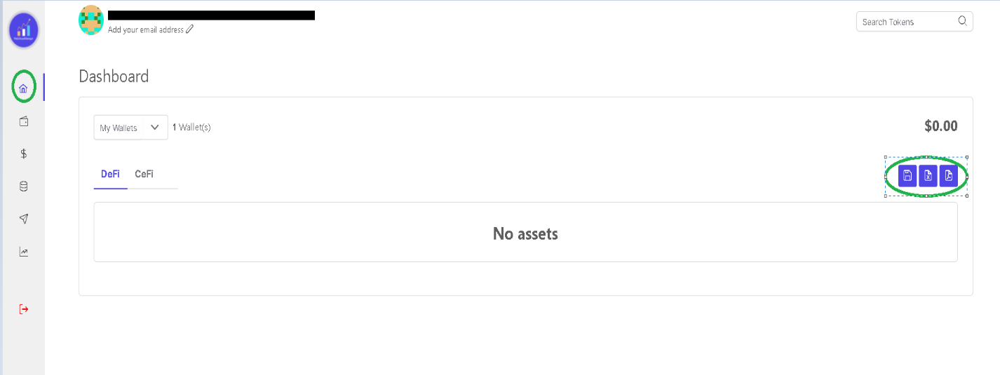
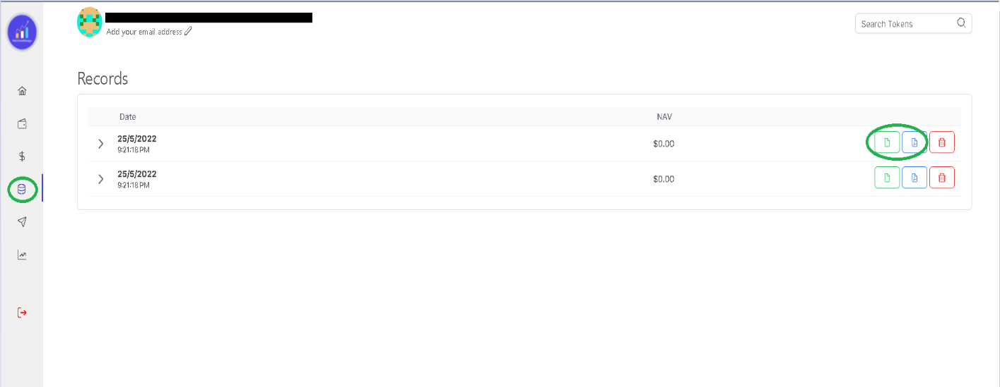

There are various ways to download the details of your investments. 

## Via Dashboard
On your dashboard you can click on download as PDF file or as CSV
file to save the details of your investments. 

## Via Snapshot 
Snapshots can be downloaded as PDF or CSV file.  
!!!
Please refer to [this guide](/Taking-snapshot-of-Investments.md) in order to take a snapshot of your investments. 
!!!

## Via Records
In the records section, you can click on the respective buttons to download them as a PDF or CSV File

Now all your saved records will appear on the page and it will have the time when it was saved. You can download the records from here as well. Both as a CSV file or as a PDF file, whichever suits your needs.

You can download your files multiple times in case you lose them. But if you delete them from the records, you will no longer be able to retrieve them. 
 
