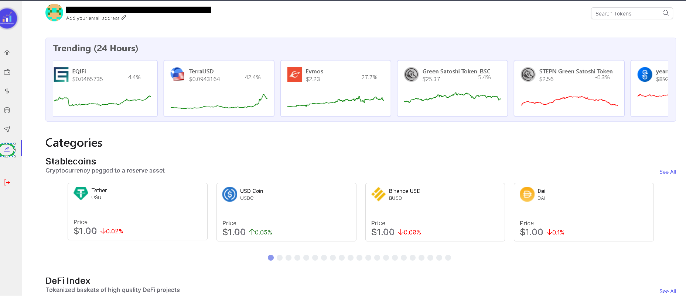
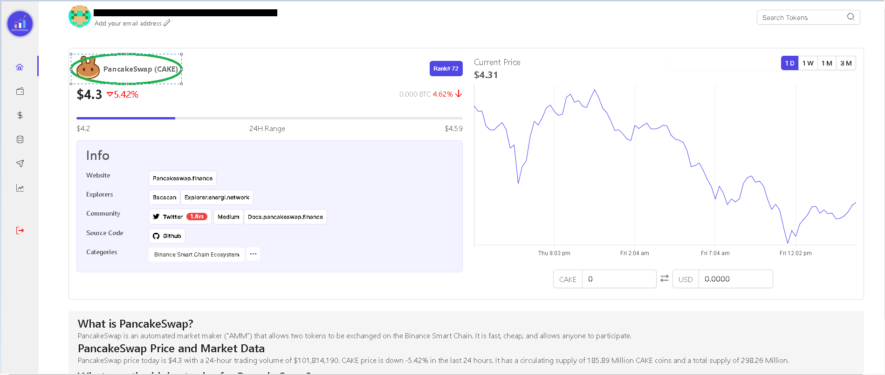

Web3AssetManager also provides you with information on top cryptocurrencies, so that you can make the best and well informed investments right from our app.  Click [here](https://www.google.com) to go to the Research Page

On the research page you can get:
- live quotes of coins,
- list of the treading coins of the past 24 hours,
- 24-hour change in values of key indexes of cryptocurrencies 
- list of specific categories of coins such as metaverse, CeFi, DEX, stablecoins etc. 

Using Web3AssetManager makes the researching process very easy and efficient. We have almost all the coin list and you can get analytics on any coin by simply clicking on it.

Once you click on any coin icon, you will be directed to a new tab and the following screen will load. 

This page will give you access to information such as: 
-  Price data (24 hrs) 
- Price chart 
- Coin rank by market capital 
- Links to social media handle, news about the coin. 
- Analytics like volume, circulating supply etc. 
