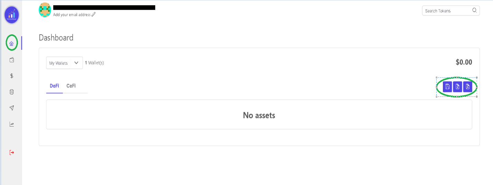
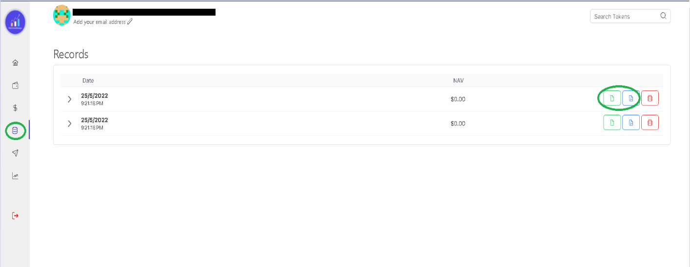

Taking a snapshot of your current investments and the current market price of the same is now made easy with Web3AssetManager. 
There are numerous ways of doing it. 

1.  The easiest is to click on the save button on the dashboard in order to save it as a record. 

 

 
 
 

2.  Another way of taking a snapshot is by clicking on the records button. 

You will be taken to the record page. Since this will be the first time you will be taking a snapshot. Click on the link to take the snapshot. Your previous snapshots will also be accessible to you once you save it. You can save it as a record so that it can be accessed on the app. You can also download you snapshot as a PDF or as a CSV file. 
