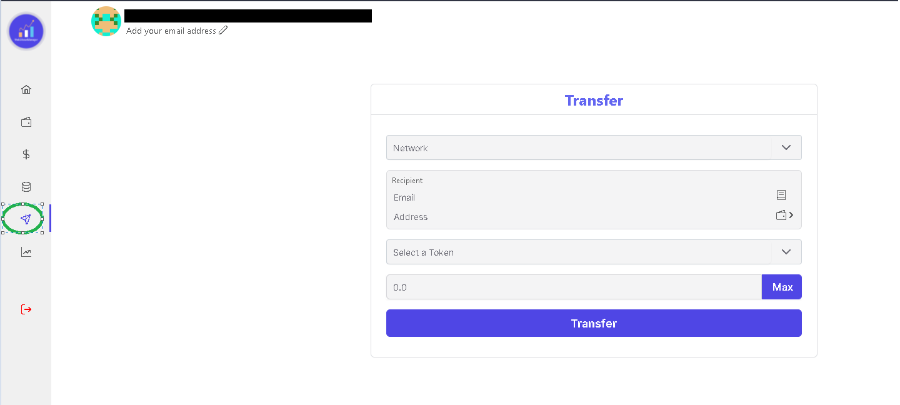

There are a few different ways you can transfer funds to a wallet. You can either send it directly to their wallet address if you know it. You can also search for them by their email address, if they have registered their email address on our app. 

Alternatively, you can also save their wallet address in your contacts to make it easier. 

Click on the transfer icon as shown below to go to the transfer page 

+++ With Wallet Address 
1. Select the network on which you would like make the transfer 
2. Type in the recipient's wallet address to which you would like to  send the assets. 
4. Select the token from the drop-down box that you like to transfer. 
5. Enter in the number of tokens that you would like to transfer. 
6. Click on the transfer button, once you have checked every detail entered. 
7. Approve the transaction on the Metamask pop-up. 

Once you have approved the transaction, your assets will be transferred to the recipient's address. 
+++ With Email Address 
1. Select the network on which you would like make the transfer 
2. Type in the recipient's email address that they have registered with our site. 
4. Select the token from the drop-down box that you like to transfer. 
5. Enter in the number of tokens that you would like to transfer. 
6. Click on the transfer button, once you have checked every detail entered. 
7. Approve the transaction on the Metamask pop-up. 

Once you have approved the transaction, your assets will be transferred to the recipient's address. 

+++ Savng Contact
1. Select the network on which you would like make the transfer 
2. Click on the book icon next to email input field
3. Enter the wallet address and a nick name for the contact. You can also search using email address.
4. Click on save. 
5. Next time around you can simply open this popup and click on the saved contact to select the recipient. 

