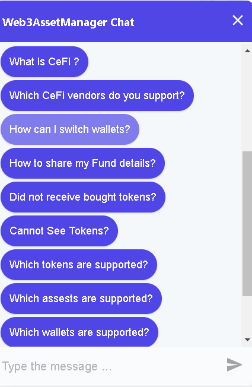

Web3AssetManager chat employs in house chat bot that makes our app more user friendly. You can do a lot of things with the help of our chat. To use the chat option, click on the chat icon of the right bottom corner and Enter your Name 

The following list of options will appear

 

Choose the option that you require help with  

- **Crypto** will help you to know the token price or you can order the list of the trending tokens of the past 24 hours. 

- **Functionality** will help you with Swapping and transfer of tokens. 

- **Support help** button will help you
with some problems that you are facing. Some of the problems include

- **About our product** will tell you about our offerings. Keep checking
this regularly to stay tuned to the latest additions. 
- **Exit** will take you out of the previously selected menu. You can
take help with any other problem that you are facing. 
 
